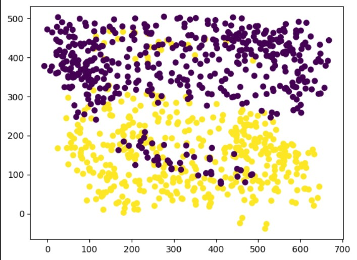

# 📕 Mini project 1

This mini project consist of 3 questions that will describe in follow:

## Question 1
### Introduction
This question contains the implementation of a linear classifier model training and evaluation process. The tasks involve generating a dataset, training the model, evaluating its performance, and visualizing the decision boundaries.

### Table of Contents
Task 1: Block Diagram of Training and Evaluation Process
Task 2: Dataset Generation and Visualization
Task 3: Training and Evaluating Linear Classifiers
Task 4: Decision Boundary Visualization
Task 5: Repeating the Process with Custom Dataset

### Task 1: Block Diagram of Training and Evaluation Process
Description
Create a block diagram illustrating the process of training and evaluating a linear classifier model. Explain the various components of the block diagram. Indicate which part of the block diagram changes when transitioning from binary classification to multi-class classification.

### Diagram

### Explanation
1- Data Collection: Collect and preprocess the data.
2- Feature Selection: Select relevant features for training the model.
3- Model Selection: Choose an appropriate linear classifier model.
4- Training: Train the model using the training dataset.
5- Evaluation: Evaluate the model using the testing dataset.
6- Prediction: Use the trained model to make predictions on new data.
7- Feedback Loop: Use evaluation metrics to tune the model and improve performance.
8- Multi-Class Classification
9- In multi-class classification, the model selection and training components need adjustments to handle multiple classes. This often involves using techniques like One-vs-Rest (OvR) or Softmax for multi-class support.

### Task 2: Dataset Generation and Visualization
Description
Generate a dataset with 1000 samples, 4 classes, and 3 features using sklearn.datasets. Visualize the dataset and discuss its complexity. Suggest ways to make the dataset more challenging.

### Task 3: Training and Evaluating Linear Classifiers
Description
Use at least two linear classifiers from sklearn.linear_model with appropriate hyperparameters to distinguish between the four classes in the dataset. Explain the process of selecting hyperparameters and display the training and evaluation accuracy.

Hyperparameter Selection
The hyperparameters for each classifier were chosen based on common practices and adjusted using cross-validation to optimize performance.

### Task 4: Decision Boundary Visualization
Description
Visualize the decision boundaries of the trained model along with the dataset samples. Highlight misclassified samples with different shapes and colors.

## Question 2
This questiom explores fault detection using the CWRU Bearing dataset. The CWRU Bearing dataset is widely used for diagnosing faults in bearings using machine learning techniques. This README provides an overview of the dataset, steps to preprocess the data, extract features, and build machine learning models for fault detection.

### Dataset Overview
The CWRU Bearing dataset consists of vibration signals from bearings under different conditions:

Normal Condition (Normal_X): Data from bearings operating under normal conditions.
Fault Condition (IR007_X): Data from bearings with inner race faults (IR) in state 007.
Objectives
The main objective of this dataset is to classify the health status of bearings based on vibration signals. This helps in early detection of faults and preventive maintenance.

#### Steps to Form the Dataset
#### Step 1: Data Acquisition
Download data from the respective pages:
Normal Condition Data
Fault Condition Data
#### Step 2: Data Preprocessing
Separate M samples of length N from each class (M >= 100, N >= 200).
Formulate an M × N matrix for both classes along with their respective labels.
#### Step 3: Feature Extraction
Extract at least 8 features from the dataset using the formulas mentioned in Table 1:

#### Step 4: Importance of Feature Extraction
Feature extraction reduces dimensionality and improves model accuracy by capturing essential information from raw data.

#### Step 5: Data Mixing and Splitting
Mix data if possible and divide it into reasonable training and evaluation ratios.

#### Step 6: Data Normalization
Normalize data to ensure consistent scaling of features. Choose one of the following normalization methods:

Min-Max Scaling: Scales data to a range of 0 to 1.
Standardization: Scales data to have a mean of 0 and variance of 1.
### Conclusion
This question aims to provide a comprehensive guide on using the CWRU Bearing dataset for fault detection. By following the steps outlined above, you can preprocess the dataset, extract relevant features, and normalize data for training machine learning models effectively.

You can find used dataset for question number 2 in link below.
### [Dataset](https://engineering.case.edu/bearingdatacenter/download-data-file)

## Question 3
This question aims to analyze the relationship between temperature and humidity using the Weather in Szeged 2006 dataset. We will perform exploratory data analysis (EDA) and build regression models to estimate temperature based on humidity.

### Dataset Overview
Dataset Name: Weather in Szeged 2006
Features: Temperature (Temperature (C)), Humidity (Humidity)
Objective: Analyze the relationship between temperature and humidity, and build regression models to predict temperature.
Exploratory Data Analysis (EDA)
Heatmap of Correlation

The heatmap shows the correlation between Temperature and Humidity. It helps us understand the linear relationship between these variables.

Scatter Plot: Temperature vs Humidity

The scatter plot visualizes how Temperature varies with Humidity. It helps in identifying any patterns or trends in the data.

Histograms
Temperature Histogram

Humidity Histogram

The histograms show the distribution of Temperature and Humidity values in the dataset.

### Regression Modeling
Linear Regression (LS)
We fit a simple linear regression model to predict Temperature using Humidity.

Model Equation: Temperature = β₀ + β₁ * Humidity + ε
Performance: Evaluate using Mean Squared Error (MSE).
Visualization: Plotting the regression line over the scatter plot provides insight into the fit of the model.
Weighted Least Squares (WLS)
Weighted Least Squares adjusts LS by assigning different weights to data points based on their variance. It can handle heteroscedastic errors (unequal variance across data points).

#### Recursive Least Squares (RLS)
RLS is beneficial for handling streaming data or situations with dynamically changing data points. It continuously updates the model as new data arrives, making it suitable for real-time applications.

### Conclusion
This question provides an overview of analyzing the Weather in Szeged 2006 dataset, exploring the relationship between temperature and humidity, and building regression models. For detailed implementation and results, refer to the corresponding code and notebooks.

You can find used dataset for question number 3 in link below.
### [Dataset](https://www.kaggle.com/datasets/budincsevity/szeged-weather/data)

