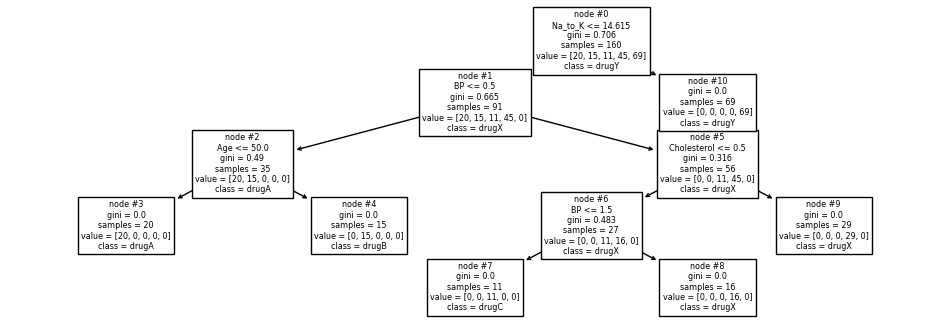

# 📗 Mini project 2
These files are the solution of the second home work of the Machine Learning course.

## Question 1 

Classifying Points in a Triangle
This code implements a simple neural network to classify points within a triangle. The network utilizes a single neuron with different activation functions (ReLU and Sigmoid) to explore their impact on the classification task.

## Functionality:

### Data Generation: 2000 random data points are generated within a specified range.

### Network Architecture:
Each data point is represented by its x and y coordinates (2-dimensional input).
The network aims to classify points: 1 for points inside the triangle's shaded area, 0 for points outside.
A single neuron with adjustable weights and bias processes the input.

### Classification with Different Activation Functions:
ReLU (Rectified Linear Unit): y = max(0, z), where z is the weighted sum of inputs.
Sigmoid: y = 1 / (1 + exp(-z)), introducing a smooth S-shaped curve for activation.

#### Diagram of the model: 

### Visualization:
 The generated points are plotted with colors indicating their classification:
- Green: Points classified as "inside" (output 1)
- Red: Points classified as "outside" (output 0)
- Triangle outline for reference

### Experimentation:

This code allows you to experiment with both ReLU and Sigmoid activation functions and observe how they influence the classification boundary. You can easily modify the code to explore the impact of different network parameters (weights, bias) or even try more complex network architectures.

### RESULT :

## Question 2 

### Bearing Fault Classification with Multilayer Perceptron (MLP)

This Python notebook explores the use of Multilayer Perceptrons (MLPs) for classifying bearing faults. It leverages features extracted from vibration data in the CWRU dataset.

### Key Features:

- Feature Extraction: The notebook preprocesses vibration time series data, extracting informative features like mean, standard deviation, and root mean square (RMS).
- Model Comparison: Two MLP models are trained and compared:
  - Model 1: Utilizes the Adam optimizer and sparse categorical cross-entropy loss.
  - Model 2: Employs the SGD optimizer and Kullback-Leibler divergence loss.

### Generalizability Assessment:
 K-Fold cross-validation is used to rigorously evaluate the models' ability to generalize to unseen data.

This project investigates the effectiveness of different optimizers and loss functions for MLP-based bearing fault classification, providing insights into their performance on real-world data.

### Result

#### Accuracy :

The data set could be find in link below
### [Dataset](https://engineering.case.edu/bearingdatacenter/download-data-file)

## Question 3 

### Drug Classification with Decision Trees and Random Forests

This project explores the application of decision trees and random forests for drug classification using the Drug dataset from Kaggle. It investigates how pre-pruning, post-pruning, undersampling, and hyperparameter tuning can influence the performance and complexity of these models.

### Key Techniques:

- Data Preprocessing:
 The Drug dataset is cleaned, feature-engineered, and undersampled to address class imbalance and enhance model effectiveness.
- Decision Tree Training:
 Decision tree models are trained with different hyperparameters for pre-pruning (regulating tree growth), post-pruning (removing redundant branches), and default settings.
- Visualization and Evaluation:
 The decision tree structures are visualized to understand their decision-making processes, and their performance is evaluated using classification reports that include metrics like accuracy, precision, recall, and F1-score.
- Random Forest Comparison:
 A random forest model is trained with default hyperparameters and evaluated on the test set, allowing for a comparison with decision tree performance.

### Model of the Decision Tree :

This project offers valuable insights into the impact of various techniques on decision trees and random forests in drug classification tasks. It highlights the importance of data preprocessing and hyperparameter tuning for achieving optimal model performance.

The data set is generated by link below
### [Dataset](https://scikit-learn.org/stable/modules/generated/sklearn.datasets.fetch_covtype.html#sklearn.datasets.fetch_covtype)

## Question 4 

This Jupyter Notebook tackles heart disease prediction using a Naive Bayes classifier. It leverages the Heart Disease Dataset for training and evaluation.

### Key Steps:

### Data Preparation:
- The notebook loads the dataset.
- It meticulously preprocesses the data, including shuffling for randomness, splitting into training and testing sets, and normalization for improved model performance.

### Model Training and Evaluation:
- A Gaussian Naive Bayes model is trained on the prepared data.
- The model's performance is evaluated using comprehensive metrics:
  - Accuracy score: Overall correctness of predictions.
  - Classification report: Detailed breakdown of precision, recall, and F1-score for each class (presence/absence of heart disease).
  - Confusion matrix: Visual representation of true and false positives/negatives.
- Example Prediction:
  - The notebook demonstrates how to make a random prediction using the trained model, providing an illustrative example of its application.
### Result : 
  
  
This project offers a clear guide to building and evaluating a Naive Bayes classifier for heart disease prediction.

The Dataset could be found in link below

### [Dataset](https://www.kaggle.com/datasets/johnsmith88/heart-disease-dataset)

