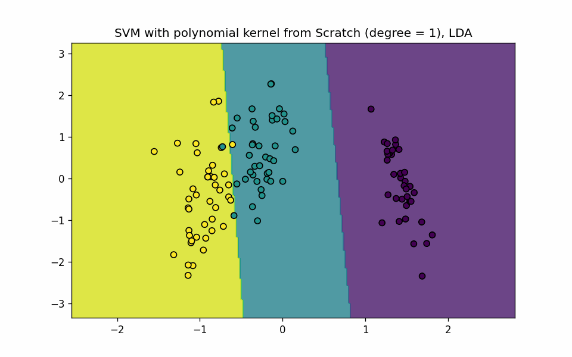
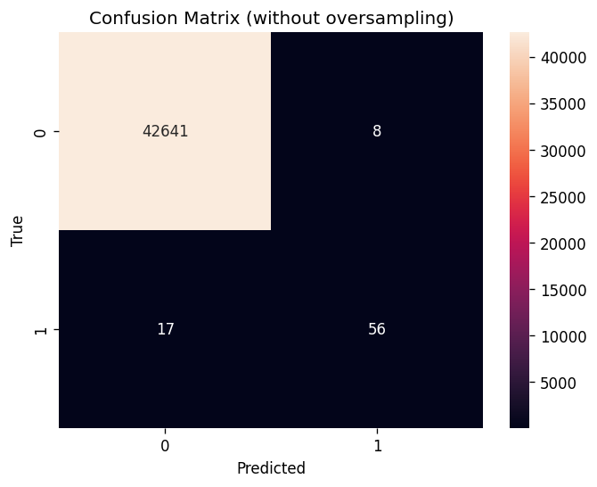

# 📘 Mini project 3

# Question 1

This project delves into Support Vector Machine (SVM) algorithm exploration on the Iris dataset. It investigates the effectiveness of dimensionality reduction, explores linear and polynomial kernels (degrees 1-10), and compares results using metrics and visualizations. The project offers two approaches:

- Scikit-learn Integration: Leverages scikit-learn for SVM classification, dimensionality reduction (method to be specified), and visualization of decision boundaries and principal feature separation in GIF format (degrees 1-10).

- Scratch Implementation: Implements a custom SVM class with kernel_Polynomial, Fit, and Predict methods for polynomial kernels (degrees 1-10). Evaluates accuracy and visualizes principal feature separation in GIF format (degrees 1-10).

This project provides insights into SVM behavior with different kernels and dimensionality reduction, along with code examples (both scikit-learn and scratch implementation).

## Result :
the Scratch Decision Boundries: 

The IRIS dataset could be found in this 
### [Dataset ](https://www.kaggle.com/datasets/budincsevity/szeged-weather/data)

# Question 3

## Fraud Detection Model Exploration with Deep Learning
This project delves into the implementation and analysis of a deep learning model for fraud detection. It explores the challenges of imbalanced datasets and concept drift, which are common hurdles in this domain.

The project investigates the approach presented in a research paper (citation required). This approach tackles these challenges by:

- Utilizing cost-sensitive learning to prioritize accurate detection of fraudulent transactions.
- Employing ensemble learning to combine multiple models for enhanced robustness and versatility.
- Implementing feature selection to reduce data dimensionality and improve model efficiency.

We will build and train the proposed network architecture using a chosen programming language and deep learning framework. The training process will incorporate early stopping to prevent overfitting and ensure optimal model performance.

We will then evaluate the model's effectiveness on unseen data, employing metrics like accuracy, precision, recall, and F1-score. Additionally, we will explore the limitations of accuracy as a sole metric for imbalanced datasets and investigate the trade-off between accuracy and recall using oversampling techniques.

Furthermore, the project will analyze the model's performance when trained on imbalanced data with noise, comparing it to the performance with noise removal. This will provide insights into the impact of noise on the model's ability to detect fraudulent transactions.

Note: When hyperparameters are not specified in the paper, we will make informed choices based on best practices. The project aims to gain practical experience with the model rather than replicate the exact paper results.

## Result:
Confusion Matrix

The dataset link could be found in following link 
### [Dataset](https://www.kaggle.com/datasets/mlg-ulb/creditcardfraud)

